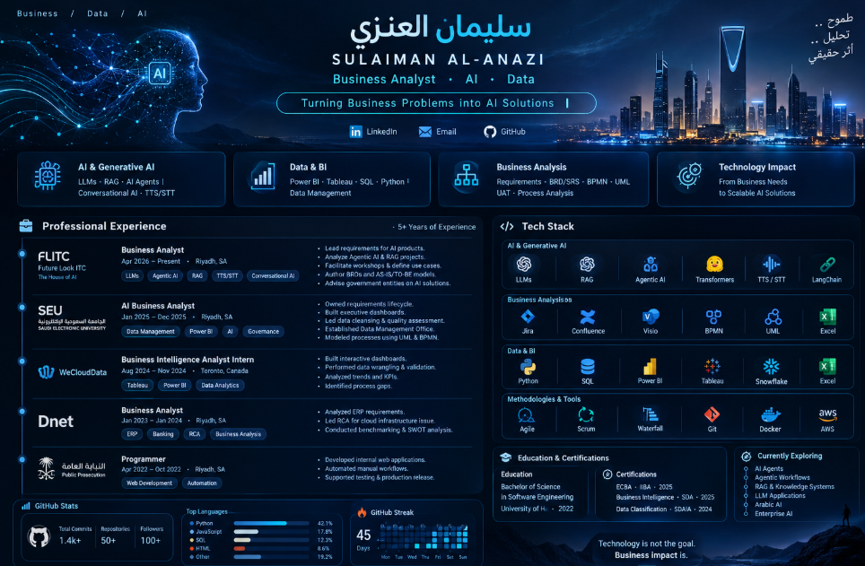

<div align="center">


<br>


<br><br>



<br><br>

<a href="https://linkedin.com/in/sulimanalanazi">

</a>

<a href="https://github.com/S0x7E2">

</a>


</div>

---

# 🧠 About Me

> **Turning Business Problems into AI Solutions.**

I'm a **Business Analyst** focused on bridging the gap between **business strategy, data, artificial intelligence, and technology**.

My work sits at the intersection of:

`BUSINESS` × `DATA` × `AI` × `TECHNOLOGY`

I translate complex business problems into:

**Requirements → Processes → Data → AI Solutions → Business Value**

### 🎯 Focus Areas

- 🤖 Generative AI & Agentic AI
- 🧩 Business Analysis & Requirements Engineering
- 📊 Data Analytics & Business Intelligence
- ⚙️ Digital Transformation
- 🏗️ AI Architectures
- 🔗 API & System Integration

---

# ⚡ Core Skills

<table>
<tr>
<td width="50%" valign="top">

## 🤖 AI & Generative AI

`LLMs`  
`Agentic AI / AI Agents`  
`RAG (Retrieval-Augmented Generation)`  
`Prompt Engineering`  
`Conversational AI`  
`TTS / STT`

</td>

<td width="50%" valign="top">

## 🧩 Business Analysis

`Requirements Elicitation & Analysis`  
`BRD & SRS Writing`  
`Gap Analysis`  
`Process Mapping`  
`UML`  
`BPMN`  
`User Stories`  
`Acceptance Criteria`

</td>
</tr>

<tr>
<td width="50%" valign="top">

## 📊 Data & BI

`Power BI`  
`Tableau`  
`SQL`  
`Excel`  
`Data Cleaning`  
`EDA`  
`KPI Reporting`  
`Dashboard Design`  
`Data Management`

</td>

<td width="50%" valign="top">

## ⚙️ Methodologies & Tools

`Agile`  
`Scrum`  
`Waterfall`  
`SDLC`  
`JIRA`  
`Confluence`  
`Visio`  
`Microsoft Office Suite`

</td>
</tr>

<tr>
<td width="50%" valign="top">

## 💻 Programming & Integration

`Python`  
`SQL`  
`API Integration`  
`Git`

</td>

<td width="50%" valign="top">

## 📐 Mathematics for AI

`Linear Algebra`  
`Probability & Statistics`  
`Calculus`

</td>
</tr>
</table>

---

# 🏗️ AI Architectures

<div align="center">


</div>

```text
                  ARTIFICIAL INTELLIGENCE
                           │
             ┌─────────────┴─────────────┐
             ↓                           ↓
      NEURAL NETWORKS              TRANSFORMERS
             │                           │
             └─────────────┬─────────────┘
                           ↓
                          LLMs
                           │
              ┌────────────┼────────────┐
              ↓            ↓            ↓
             RAG       AI AGENTS      GENAI
              │            │            │
              └────────────┼────────────┘
                           ↓
                  BUSINESS SOLUTION
